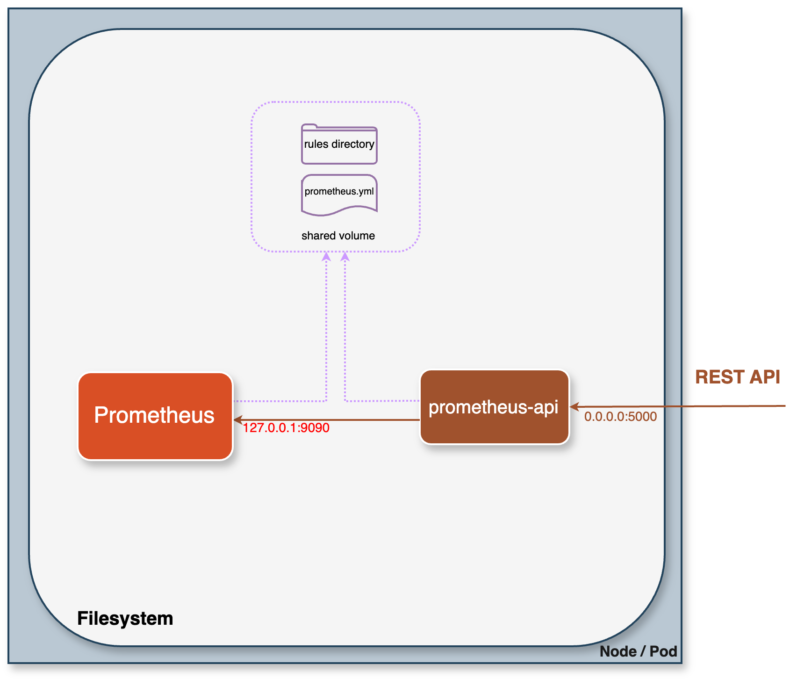

# prometheus-api
> Extended HTTP API service for Prometheus
> 


[](https://hub.docker.com/r/hayk96/prometheus-api/)
[](https://hub.docker.com/r/hayk96/prometheus-api/)
[](https://hub.docker.com/r/hayk96/prometheus-api/)

<!-- TABLE OF CONTENTS -->
<details open="open">
  <summary>Table of Contents</summary>
  <ol>
    <li>
      <a href="#about-the-project">About The Project</a>
    </li>
    <li>
      <a href="#architecture-overview">Architecture Overview</a>
    </li>
    <li>
      <a href="#getting-started">Getting Started</a>
      <ul>
        <li><a href="#prerequisites">Prerequisites</a></li>
        <li><a href="#quick-start">Quick Start</a></li>
      </ul>
    </li>
    <li><a href="#examples">Examples</a></li>
    <li><a href="#api-model">API model</a></li>
    <li><a href="#roadmap">Roadmap</a></li>
    <li><a href="#author-and-maintainer">Author and Maintainer</a></li>
    <li><a href="#licence">License</a></li>
  </ol>
</details>

<!-- ABOUT THE PROJECT -->
## About The Project

This project enhances the native [Prometheus HTTP API](https://prometheus.io/docs/prometheus/latest/querying/api/) by 
providing additional features and addressing its limitations. Running as a sidecar alongside the Prometheus server 
enables users to extend the capabilities of the API.

One notable limitation of the native Prometheus HTTP API is the inability to programmatically create/delete rules. This 
project addresses this limitation by offering a solution for rule creation/deletion via the API. By leveraging 
**prometheus-api**, users can overcome the native constraints, gaining the ability to create rules programmatically. This 
enhances flexibility and automation in monitoring and alerting workflows.

> ⓘ The decision to exclude a rule creation feature in the Prometheus API, as discussed in 
> [this GitHub issue](https://github.com/prometheus/alertmanager/issues/552), prioritizes stability and integrity within
> the Prometheus ecosystem. **prometheus-api** serves as an external solution, seamlessly integrating with existing 
> Prometheus deployments while providing the sought-after rule-creation capability.

<!-- ARCHITECTURE OVERVIEW -->
## Architecture Overview


<!-- GETTING STARTED -->
## Getting Started

### Prerequisites

The following prerequisites are required to get up and running with this tool:
- The Prometheus server's rules directory must be shared and accessible
- The Prometheus lifecycle API must be enabled to allow requesting the /reload API

### Quick Start

Get prometheus-api up and running in minutes.    
In this quick-start guide, you will run Prometheus and prometheus-api services using Docker Compose and send requests to
the API service. Please refer to [this example](https://github.com/hayk96/prometheus-api/tree/main/docs/examples/docker#getting-started-with-docker-compose) 
guide to get started.

<!-- ARCHITECTURE OVERVIEW -->
## Examples
A simple example of recording rules created using an API would be:

### Request

```shell
curl -i -XPUT 'http://localhost:5000/api/v1/rules/example-record.yml' \
--header 'Content-Type: application/json' \
--data '{
  "data": {
    "groups": [
      {
        "name": "ExampleRecordingRule",
        "rules": [
          {
            "record": "code:prometheus_http_requests_total:sum",
            "expr": "sum by (code) (prometheus_http_requests_total)"
          }
        ]
      }
    ]
  }
}'
```

### Response

```
HTTP/1.1 201 Created
content-length: 66
content-type: application/json

{"status":"success","message":"The rule was created successfully"}
```

<!-- ARCHITECTURE OVERVIEW -->
## API Model

The **prometheus-api**, built upon REST API design principles, provides a seamless and efficient way to interact with 
native Prometheus HTTP API. If you would like to explore its capabilities and learn more about its endpoints, request 
formats, and response structures, please refer to the comprehensive documentation available [here](https://github.com/hayk96/prometheus-api/tree/main/docs/rest-api).

<!-- ROADMAP -->
## Roadmap

- [ ] Add Prometheus instrumentation to expose metrics.
- [ ] Add a Bulk API to allow the creation of multiple rules via a single API call.
- [ ] Implement a way to update existing rules through the API.

<!-- CONTACT -->
## Author and Maintainer

Hayk Davtyan:
- Email - hayko5999@gmail.com
- GitHub - [hayk96](https://github.com/hayk96)

## License

MIT License, see [LICENSE](https://github.com/hayk96/prometheus-api/blob/main/LICENSE).